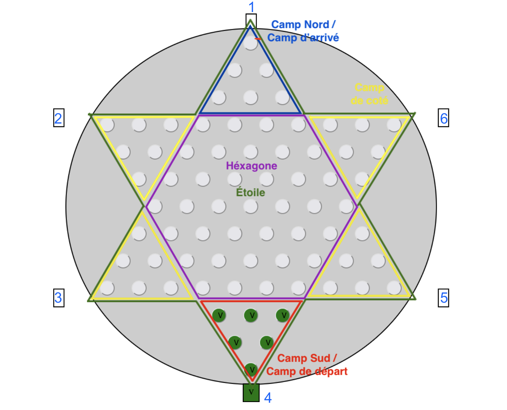

# Compte Rendu

## **Question 1**

- i < -dim correspond au **camp du Sud**
- i > dim correspond au **camp du Nord**
- j < -dim correspond au **camp de coté numéro deux comme indiqué ci dessous** (insérer image)
- correspond au point le plus haut du **camp nord**
- correspond au le point le plus haut à gauche du **camp Sud**
- correspond à **l'hexagone plus le camp nord, le camp de coté trois et le camp de coté cinq**.



## **Question 2**

La formule booléenne qui est vraie si et seulement si une case est dans le losange Nord-Sud :

```ocaml
-dim <= j && k <= dim && -dim <= k && k <= dim\
```

Implémentation :

```ocaml
    let est_dans_losange ((i,j,k):case) (dim:dimension) : bool =
        -dim <= j && k <= dim && -dim <= k && k <= dim 
    ;;
```

## **Question 3**

La formule booléenne qui est vraie si et seulement si une case est dans l’étoile est :

```
(i>= -dim && j>= -dim && k>= -dim) || (i<=dim && j<=dim && k<=dim)
```

Implémentation :

```ocaml
    let est_dans_étoile ((i,j,k):case) (dim:dimension) : bool =
        (i>= -dim && j>= -dim && k>= -dim) || (i<=dim && j<=dim && k<=dim)

    ;;
```

## **Question 4**

```ocaml
let tourner_case (m:int) (c:case) : case =
  let rec tourner_case_1 (m:int) (c:case) : case =
    if m = 0 then
      c
    else
      let (i,j,k)=tourner_case_1 (m-1) c in
        let (i,j,k)=(-k,-i,-j) in
          (i,j,k)
  in
  tourner_case_1 m c
;;
```

## **Question 5**

```ocaml
let translate (c:case) (v:vecteur) : case =
  let (c1,c2,c3)=c in
  let (v1,v2,v3)=v in
  let (d1,d2,d3)=(c1+v1,c2+v2,c3+v3) in
  (d1,d2,d3)
;;
```

## **Question 6**

```ocaml
let diff_case (l:case) (r:case) : vecteur =
  let (l1,l2,l3)=l in
  let (r1,r2,r3)=r in
  let (v1,v2,v3)=(l1-r1,l2-r2,l3-r3) in
  (v1,v2,v3)
;;
```

## **Question 7**

```ocaml
let sont_cases_voisines (l:case) (r:case) : bool =
  let (l1,l2,l3)=l in 
  let (r1,r2,r3)=r in 
  let (k1,k2,k3)=(l1-r1,l2-r2,l3-r3) in
  (k1= 1 && k2= -1 && k3=0) ||
  (k1=1 && k2=0 && k3= -1) ||
  (k1=0 && k2=1 && k3= -1) ||
  (k1= -1 && k2=1 && k3=0) ||
  (k1= -1 && k2=0 && k3=1) ||
  (k1=0 && k2= -1 && k3=1)
;;
```

## **Question 8**

```ocaml
let abs (x:int) : int =
  if x < 0 then -x else x
;;

let calcul_pivot ((x1,y1,z1):case) ((x2,y2,z2):case) : case option =
  let (x,y,z)=(x2-x1,y2-y1,z2-z1) in
  if x=0 then if y= -z && (abs(y) mod 2)=0 then Some ((x2+x1)/2,(y2+y1)/2,(z2+z1)/2) else None
  else if y=0 then if x= -z && (abs(x) mod 2)=0 then Some ((x2+x1)/2,(y2+y1)/2,(z2+z1)/2) else None
  else if z=0 then if y= -x && (abs(y) mod 2)=0 then Some ((x2+x1)/2,(y2+y1)/2,(z2+z1)/2) else None
 else None
;;
```

## **Question 9**

```ocaml
let vec_et_dist ((x1,y1,z1):case) ((x2,y2,z2):case) : vecteur*int =
  let (x,y,z)=(x2-x1,y2-y1,z2-z1) in
  if x=0 then
    let d=abs y in
    (x/d,y/d,z/d),d
  else
    if y=0 then
    let d=abs z in
    (x/d,y/d,z/d),d
    else
      let d=abs x in
      (x/d,y/d,z/d),d (*Demander au prof d'ocaml*)
;;
```

## **Question 10**

### Réalisation

#### tourner_liste

- **Algorithme** : Disjonction des cas vide et non vide. Pour le cas vide on renvoie vide et on renvoie la fin de la liste concaténé au premier élément.
- **Implémentation** :

```ocaml
let tourner_liste (l : 'a list) : 'a list =
  if l=[]
    then []
  else let (pr::fin)=l in
    fin@[pr]
;;
```

#### der_liste

- **Algorithme** : En utilisant la récursivité et des structures conditionnelles on traite les cas avec un seul élément et plusieurs.
- **Équations récursives** :

1. der_liste(pr::[]) = pr
2. der_liste(pr::fin) = der_liste fin

- **Implémentation** :

```ocaml
let rec der_liste (l:'a list) : 'a =
  match l with
  |pr::[] -> pr
  |pr::fin -> der_liste fin
;;
```

## **Question 11**

### Réalisation

#### remplir_segment

- **Algorithme** : déf réc de la fonction par équations.
- **Équations récursives** :

1. remplir_segment(0,c)=[]
2. remplir_segment(1,c)=[c]
3. remplir_segment(x,(c1,c2,c3))=[c]@remplir_segment(x-1 (c1,c2+1,c3-1))

- **Implémentation** :

```ocaml
let rec remplir_segment (m:int)((i,j,k):case): case list =
  match m with
  | 0 -> []
  | 1 -> [(i,j,k)]
  | x -> [(i,j,k)]@(remplir_segment (x-1) (i,j+1,k-1))
;;
```

## **Question 12**

### Réalisation

#### remplir_triangle_bas

- **Algorithme** : déf réc de la fonction par équations.
- **Équations récursives** :

1. remplir_triangle_bas 0 c =[]
2. remplir_triangle_bas n c = (remplir_segment n (i,j, k))@(remplir_triangle_bas (n-1) (i+1,j,k-1))

- **Implémentation** :

```ocaml
let rec remplir_triangle_bas (m:int)((i,j,k):case): case list =
  match m with
  | 0 -> []
  | n -> (remplir_segment n (i,j, k))@(remplir_triangle_bas (n-1) (i-1,j+1,k))
;;
```

## **Question 13**

### Réalisation

#### remplir_triangle_haut

- **Algorithme** : déf réc de la fonction par équations.
- **Équations récursives** :

1. remplir_triangle_bas 0 c =[]
2. remplir_triangle_bas n c = (remplir_segment n (i,j, k))@(remplir_triangle_bas (n-1) (i-1,j+1,k))

- **Implémentation** :

```ocaml
let rec remplir_triangle_haut (m:int)((i,j,k):case): case list =
  match m with
  | 0 -> []
  | n -> (remplir_segment n (i,j, k))@(remplir_triangle_haut (n-1) (i+1,j,k-1))
;;
```

## **Question 14**

### Implémentation

```ocaml
let rec colorie (co:couleur) (list_ca:case list) : case_coloree list =
  match list_ca with
  | [] -> []
  | pr::fin -> (pr, co)::(colorie co fin)
;;
```

## **Question 15**

### Implémentation

```ocaml
let nombre_joueurs (liste_couleur:couleur list) : int =
  List.length liste_couleur
;;

let rec tourner_liste_case_coloree (m:int) (liste_case_coloree:case_coloree list) : case_coloree list =
  match liste_case_coloree with
  | [] -> []
  | (case,couleur)::fin -> (tourner_case m case, couleur)::tourner_liste_case_coloree m fin
;;

let tourner_config (config:configuration) : configuration =
  let (liste_case_coloree,liste_couleur,dim)=config in
  let nb_joueurs=nombre_joueurs liste_couleur in
  (tourner_liste_case_coloree (6/nb_joueurs) liste_case_coloree,liste_couleur,dim)
;;
```

## **Question 16**

### Implémentation

```ocaml
let rec remplir_liste_case_coloree (nb_joueurs:int) (joueurs:couleur list) (dim:dimension) : case_coloree list =
  match joueurs with
  | [] -> []
  | pr::fin -> (colorie pr (remplir_triangle_bas dim (-dim-1,1,dim)))@(tourner_liste_case_coloree (6/nb_joueurs) (remplir_liste_case_coloree nb_joueurs fin dim))
;;

let remplir_init (joueurs:couleur list) (dim:dimension) : configuration =
  let liste_cases_coloree=
  remplir_liste_case_coloree (nombre_joueurs joueurs) joueurs dim
  in (liste_cases_coloree,joueurs,dim)
;;
```

### Test

```ocaml
affiche (remplir_init [Vert; Bleu; Code("Let")] 3);;
                                                                
                                        .                              


                                     .     .                           


                                  .     .     .                        


            Let   Let   Let    .     .     .     .     B     B     B   


               Let   Let    .     .     .     .     .     B     B      


                  Let    .     .     .     .     .     .     B         


                      .     .     .     .     .     .     .            


                   .     .     .     .     .     .     .     .         


                .     .     .     .     .     .     .     .     .      


             .     .     .     .     .     .     .     .     .     .   


                                  V     V     V                        


                                     V     V                           


                                        V                              
```

## **Question 17**

### Implémentation

```ocaml
let quelle_couleur (ca:case) (co:configuration) : couleur =
  let (liste_case_coloree,liste_couleur,dim)=co in
  associe ca liste_case_coloree Libre
;;
```

### **Question 18**

### Implémentation

```ocaml
let rec supprime_dans_config (conf:configuration) (c:case) : configuration =
  let (liste_case_coloree,liste_couleur,dim) = conf in
  ((List.filter (fun (ca,co) -> ca<>c) liste_case_coloree),liste_couleur,dim)
;;
```

## **Question 19**

### Implémentation

```ocaml
let est_coup_valide (conf:configuration) (Du(c1,c2):coup) : bool =
  let (liste_case_coloree,liste_couleur,dim)=conf in
  let joueur_courant::fin= liste_couleur in
  (sont_cases_voisines c1 c2) && 
  (associe c1 liste_case_coloree Libre)=joueur_courant &&
  (associe c2 liste_case_coloree Libre)=Libre &&
  (est_dans_losange c2 dim)
;;
```

### **Question 20**

### Implémentation

```ocaml
let appliquer_coup (conf:configuration) (Du(c1,c2)) : configuration =
  let (liste_case_coloree,liste_couleur,dim)=conf in
  let joueur_courant::fin= liste_couleur in
  let nouvelle_conf=supprime_dans_config conf c1 in
  let (liste_case_coloree,liste_couleur,dim)=nouvelle_conf in
  (liste_case_coloree@[(c2,joueur_courant)],liste_couleur,dim)
;;
```

## **Question 21**

### Implémentation

```ocaml
let mettre_a_jour_configuration (conf:configuration) (c:coup) : configuration =
  if est_coup_valide conf c then  appliquer_coup conf c else failwith "Ce coup n'est pas valide, le joueur doit rejouer"
;;

```

## Question 22

### Implementation

```
let rec est_libre_seg (c1:case)(c2:case)(c:configuration):bool=
let (vec,dist)=vec_et_dist c1 c2 in match dist with
| 1 -> true
| x -> (quelle_couleur (addition_vecteur c1 vec) c)=Libre && (est_libre_seg (addition_vecteur c1 vec) c2 c)
;;
```

## Question 23

### Implementation

```
let est_saut (c1:case)(c2:case)(c:configuration):bool =
  let pivot=(calcul_pivot c1 c2) in
  if pivot=None then false
  else let Some(case_pivot)=pivot in (est_libre_seg c1 case_pivot c) && (est_libre_seg case_pivot c2 c) && (quelle_couleur c2 c)=Libre;;
```

## Question 24

### Implementation

```
let rec est_saut_multiple (liste_cases:case list)(config:configuration):bool =
  match liste_cases with
  |[c1;c2] -> est_saut c1 c2 config
  |c1::fin -> let c2::fin2=fin in est_saut c1 c2 config && est_saut_multiple fin config
;;
```

## Question 25

```
let rec liste_est_dans_etoile (liste_cases:case list)(config:configuration):bool =
  match liste_cases with
  | [] -> true
  | c::fin -> let (_,_,dim)=config in est_dans_etoile c dim && liste_est_dans_etoile fin config
;;

let est_coup_valide_1 (conf:configuration) (liste_cases:case list) : bool =
  if List.length liste_cases = 2 then 
    let [c1;c2] = liste_cases in
    let (liste_case_coloree,liste_couleur,dim)=conf in
    let joueur_courant::fin= liste_couleur in
    (sont_cases_voisines c1 c2) && 
    (associe c1 liste_case_coloree Libre)=joueur_courant &&
    (associe c2 liste_case_coloree Libre)=Libre &&
    (est_dans_losange c2 dim)
  else
    est_saut_multiple liste_cases conf &&
    liste_est_dans_etoile liste_cases conf &&
    let (liste_case_coloree,liste_couleur,dim)=conf in est_dans_losange (der_liste liste_cases) dim
    && (let c1::fin=liste_cases in let (liste_case_coloree,liste_couleur,dim)=conf in
      let joueur_courant::fin= liste_couleur in (associe c1 liste_case_coloree Libre)=joueur_courant)
;;

let appliquer_coup_1 (conf:configuration) (liste_cases:case list) : configuration =
  let c1::fin = liste_cases in
  let c2=der_liste liste_cases in
  let (liste_case_coloree,liste_couleur,dim)=conf in
  let joueur_courant::fin= liste_couleur in
  let nouvelle_conf=supprime_dans_config conf c1 in
  let (liste_case_coloree,liste_couleur,dim)=nouvelle_conf in
  (liste_case_coloree@[(c2,joueur_courant)],liste_couleur,dim)
;;

let mettre_a_jour_configuration_1 (conf:configuration) (liste_cases:case list) : configuration =
    if est_coup_valide_1 conf liste_cases then  appliquer_coup_1 conf liste_cases else failwith "Ce coup n'est pas valide, le joueur doit rejouer"
;;
```

## Question 26

```
let augmente_score (score,conf:int*configuration) ((i,j,k),couleur : case_coloree) : int*configuration =
  let (liste_case_coloree,liste_couleur,dim) = conf in
  let protagoniste::_ = liste_couleur in
  if couleur = protagoniste then (score + i,conf) else (score,conf);;

let score (conf:configuration) : int =
  let (liste_case_coloree,liste_couleur,dim)= conf in
  let score_joueur,_=(List.fold_left augmente_score (0,conf) liste_case_coloree) in 
  score_joueur
;;

let rec score_max_joueur (ligne:int)(dim:dimension) : int =
  match ligne with
  | 0 -> 0
  | n -> (dim+1-n)*(dim+n) + score_max_joueur (n-1) dim
;;

let score_gagnant (dim:dimension) : int =
  score_max_joueur dim dim
;;
```

## Question 27

```
let score_gagnant (dim:dimension) : int =
  score_max_joueur dim dim
;;

let gagne (conf:configuration) : bool =
  let (_,_,dim)= conf in
  score conf = score_gagnant dim
;;
```

## Question 28

```

let manche (conf,co:configuration*couleur) (c:coup): configuration*couleur =
  if co==Libre then
    let nouvelle_conf=mettre_a_jour_configuration conf c in
    let gagnant= if gagne nouvelle_conf then let (_,joueur_courant::fin,_)= nouvelle_conf in joueur_courant else Libre in
    tourner_config nouvelle_conf, gagnant
  else
    conf,co
  ;;

let est_partie (conf:configuration) (liste_coup:coup list): couleur =
  let _,couleur = List.fold_left manche (conf,Libre) liste_coup in
  couleur
;;
```
